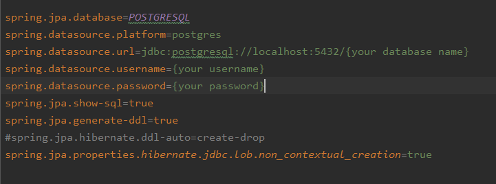
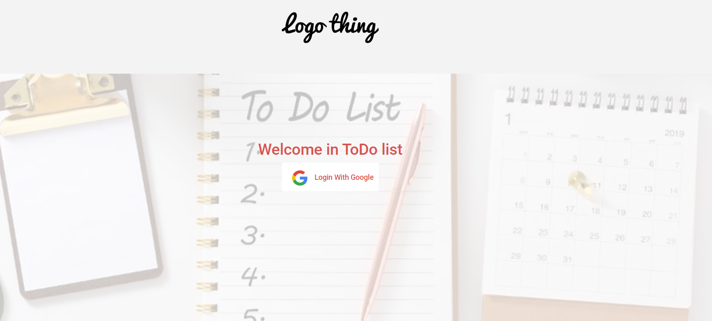
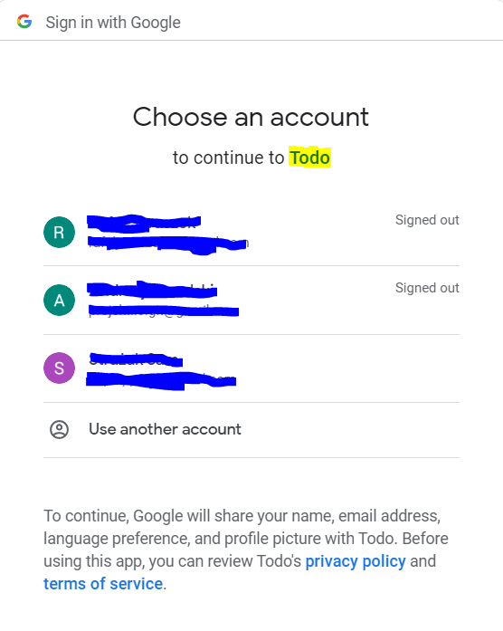
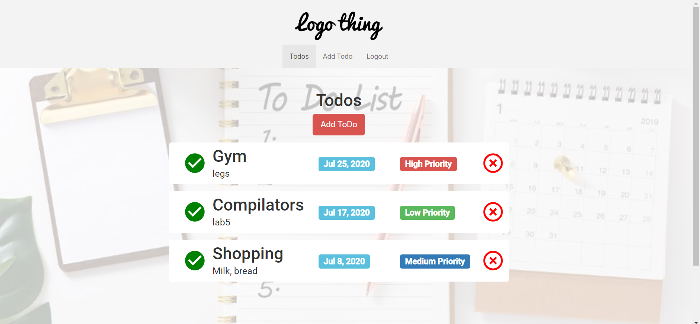
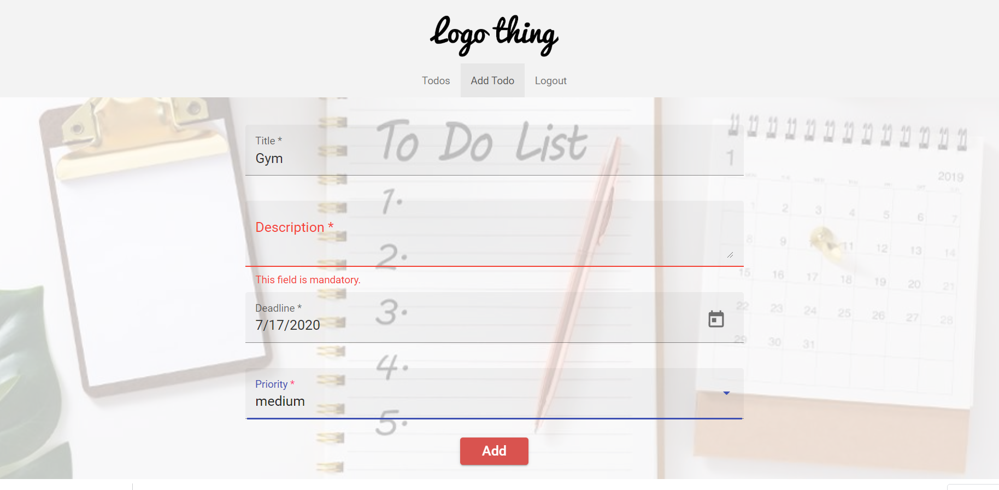
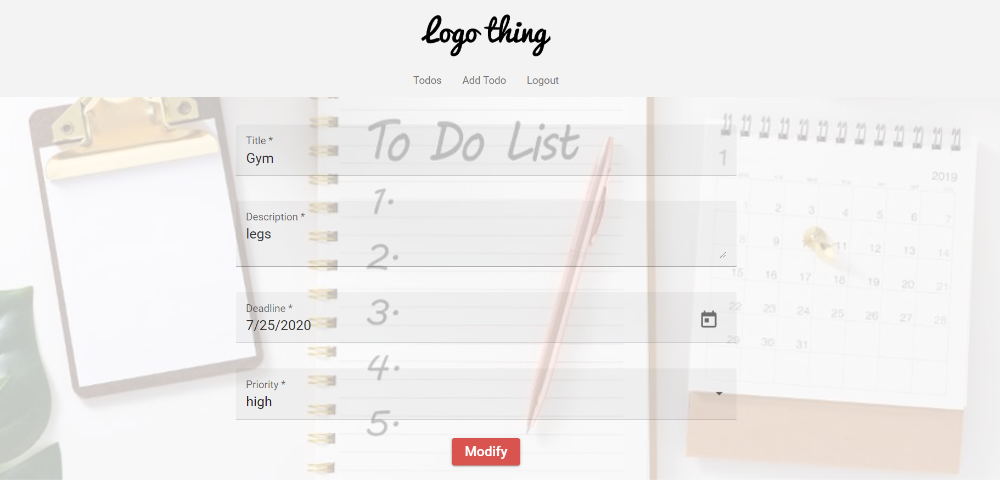

# ToDoList

> Todo app with Spring Boot + Angular + OAuth2(google)
## Requirements
* java 8+
* [postgresql](https://www.postgresql.org/download/)
* node
* npm
* ng (`npm install -g @angular/cli`)
## Database Configuration
Inside `application.properties`(server part)

## Launching Frontend
* `npm install`(inside `front/todo-app` folder)
* `npm start`

## App
### Home

### Gmail panel

### Todos

### Add Todo

### Modify Todo

